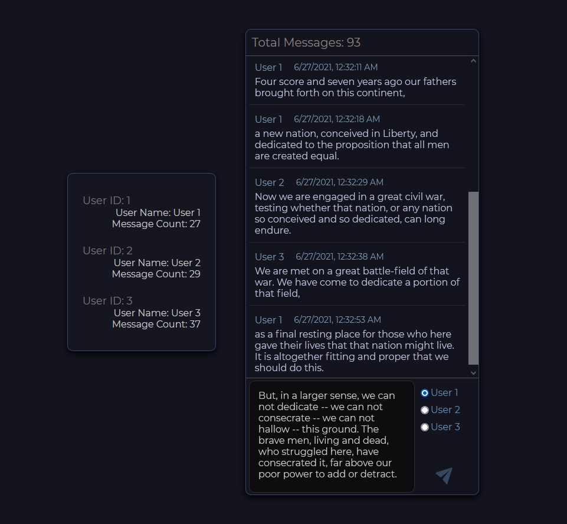

## redis demo

Small demo of redis's capabilities for RCOS. Makes use of `node-redis` library. Uses the string, set, list, and hash datatypes to store a basic chatroom feed with multiple users. Client made with react.

### Installation:

Requires node.js and redis. Clone the repo and run `npm install` in the root and in the client folder. Run `npm run dev` in the root to run the web/data server, and run `npm start` in the client folder to start the react development server at `localhost:3003`. 